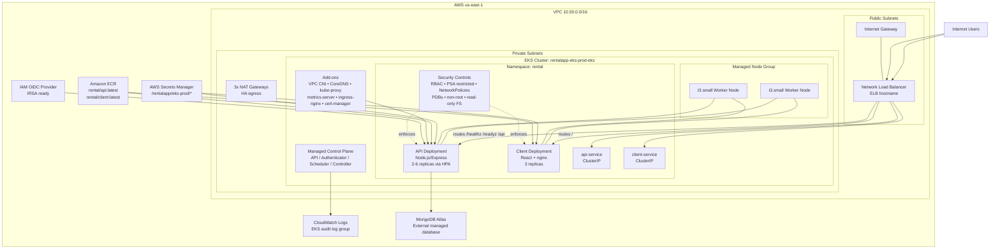

# 🚀 Production-Ready EKS Infrastructure

**Status:** ✅ **FULLY OPERATIONAL**  
**Date:** May 3, 2026  
**Cluster:** `rentalapp-eks-prod-eks`  
**Region:** `us-east-1`

---

## Architecture Diagram



---

## 📊 Infrastructure Overview

### EKS Cluster Configuration
| Component | Configuration | Status |
|-----------|---------------|--------|
| **Cluster** | rentalapp-eks-prod-eks (K8s 1.30) | ✅ Running |
| **API Endpoint** | CIDR restricted (59.103.217.174/32) | ✅ Secured |
| **Worker Nodes** | 2 × t3.small (ASG: min=2, max=6) | ✅ Ready |
| **VPC** | 10.50.0.0/16 across 3 AZs | ✅ HA |
| **Subnets** | 3× public, 3× private with NAT gateways | ✅ Configured |
| **OIDC Provider** | Enabled for IRSA (future use) | ✅ Active |

### Workloads
| Workload | Replicas | Status | Endpoint |
|----------|----------|--------|----------|
| **API** | 2 (HPA: 2-6) | ✅ Running | http://elb/api |
| **Client** | 3 | ✅ Running | http://elb/ |
| **Ingress** | 2 NGINX controllers | ✅ Ready | NLB (LoadBalancer) |

### Public Access
```
ELB Endpoint: ae3b0296de3e84446aba612ab8ecb1ea-817453542.us-east-1.elb.amazonaws.com

Routes:
  GET  /healthz          → API health check (200 OK)
  GET  /readyz           → API readiness probe (200 OK)
  GET  /api/*            → API backend (Node.js Express)
  GET  /                 → React SPA frontend (nginx)
```

---

## 🔒 Security Hardening (Completed)

### 1. API Endpoint Protection
✅ **Restricted to admin CIDR**
- Before: `0.0.0.0/0` (public)
- After: `59.103.217.174/32` (your IP)
- Applied via: [terraform/environments/eks-production/checks.tf](terraform/environments/eks-production/checks.tf)

**Verification:**
```bash
aws eks describe-cluster --name rentalapp-eks-prod-eks --region us-east-1 \
  --query 'cluster.resourcesVpcConfig.publicAccessCidrs'
# Returns: ["59.103.217.174/32"]
```

### 2. RBAC (Role-Based Access Control)
✅ **Least privilege service accounts**
- Service accounts: `rental-api`, `rental-client`
- Auto-mounting disabled (zero-token pods)
- API role: read-only access to ConfigMap (rental-api-config)
- Applied via: [k8s/base/rbac.yaml](k8s/base/rbac.yaml)

**Verification:**
```bash
kubectl get sa -n rental
# SECRETS column shows "0" (no auto-mounted tokens)

kubectl get role,rolebinding -n rental
# Shows: rental-api-config-reader role with explicit binding
```

### 3. Network Policies (Default-Deny + Explicit Allows)
✅ **Zero-trust network segmentation**

9 policies deployed:
1. **default-deny-all** - Block all ingress/egress by default
2. **allow-api-dns-egress** - API → CoreDNS (UDP/TCP 53)
3. **allow-client-dns-egress** - Client → CoreDNS (UDP/TCP 53)
4. **allow-api-egress-external** - API → External services
5. **allow-ingress-to-api** - NGINX controller → API (TCP 4000)
6. **allow-ingress-to-client** - NGINX controller → Client (TCP 8080)
7. **allow-api-egress-to-mongo** - API → MongoDB Atlas (TCP 27017)
8. **allow-mongo-ingress-from-api** - Mongo ← API (future)
9. **allow-dns-egress** - CoreDNS to external (for SRV lookups)

Applied via: [k8s/base/network-policies.yaml](k8s/base/network-policies.yaml)

**Verification:**
```bash
kubectl get networkpolicies -n rental
# Shows: 9 policies active
```

### 4. Pod Security (Containers)
✅ **Non-root, read-only filesystem, dropped capabilities**

**API Pod (User: 10001)**
```yaml
securityContext:
  runAsNonRoot: true
  readOnlyRootFilesystem: true
  capabilities:
    drop: ["ALL"]
  allowPrivilegeEscalation: false
```

**Client Pod (User: 101 - nginx)**
```yaml
securityContext:
  runAsNonRoot: true
  readOnlyRootFilesystem: true
  capabilities:
    drop: ["ALL"]
  allowPrivilegeEscalation: false
```

Writable volumes:
- API: `/tmp` (tmpfs), `/app/.cache` (emptyDir)
- Client: `/var/cache/nginx`, `/var/run`, `/tmp` (all tmpfs)

Applied via: [k8s/base/api-deployment.yaml](k8s/base/api-deployment.yaml), [k8s/base/client-deployment.yaml](k8s/base/client-deployment.yaml)

### 5. Pod Security Admission (Namespace)
✅ **Restricted profile enforced**

Applied labels:
```yaml
pod-security.kubernetes.io/enforce: restricted
pod-security.kubernetes.io/enforce-version: latest
pod-security.kubernetes.io/warn: restricted
pod-security.kubernetes.io/audit: restricted
```

Applied via: [k8s/base/namespace.yaml](k8s/base/namespace.yaml)

### 6. Secrets Management
✅ **AWS Secrets Manager → Kubernetes Secrets**

Pipeline:
1. Secrets stored in AWS Secrets Manager (`/rentalapp/eks-prod/*`)
2. `k8s/run-eks.sh` fetches at deploy time via AWS CLI
3. Generated into `k8s/overlays/eks-production/secrets.env`
4. Kustomize secretGenerator creates K8s Secret
5. Pods receive environment variables

**Secrets:**
- `MONGODB_URI` - MongoDB Atlas connection string
- `SESSION_SECRET` - Express session encryption key
- `JWT_SECRET` - JWT signing key

---

## 🔄 High Availability & Resilience

### Pod Disruption Budgets
✅ **Minimum availability guarantees**

| Workload | Min Available | Max Disruptions | Replicas |
|----------|---------------|-----------------|----------|
| API | 1/2 | 1 | 2-6 (HPA) |
| Client | 1/3 | 1 | 3 |

Ensures rolling updates/node maintenance don't disrupt service.

### Horizontal Pod Autoscaler (HPA)
✅ **Auto-scaling on CPU threshold**

```yaml
API Deployment HPA:
  Min Replicas: 2
  Max Replicas: 6
  Target CPU: 70%
```

Current status:
```
REFERENCE                 TARGETS             MINPODS MAXPODS REPLICAS
Deployment/api-deployment cpu: 0%/70% ...     2       6       2
```

### Health Probes
✅ **Liveness and Readiness configured**

**API:**
- Liveness: `/healthz` (10s initial delay, 5s timeout, 30s interval)
- Readiness: `/readyz` (10s initial delay, 5s timeout, 5s interval)

**Client:**
- Liveness: TCP port 8080 (10s initial delay)
- Readiness: TCP port 8080 (10s initial delay)

Applied via: [k8s/base/api-deployment.yaml](k8s/base/api-deployment.yaml), [k8s/base/client-deployment.yaml](k8s/base/client-deployment.yaml)

---

## 📊 Observability & Monitoring

### CloudWatch Audit Logs
✅ **EKS control plane audit logs enabled**

Log group: `/aws/eks/rentalapp-eks-prod-eks/cluster`
Retention: 1 week (configurable to 30+ days)
Audit levels: api, audit, authenticator, controllerManager, scheduler

**Quick commands:**
```bash
# View last hour of events
./scripts/view-audit-logs.sh 1

# Create dashboard
./scripts/setup-cloudwatch-dashboard.sh

# Set up alarms (requires SNS topic)
./scripts/setup-cloudwatch-alarms.sh arn:aws:sns:...
```

See [CLOUDWATCH_OBSERVABILITY.md](CLOUDWATCH_OBSERVABILITY.md) for details.

### Metrics
- CPU/Memory per pod via metrics-server
- HPA uses metrics for scaling decisions
- Node metrics via kubelet
- Container runtime metrics available

### Logging
- Application logs: `kubectl logs -n rental <pod>`
- EKS control plane logs: CloudWatch Logs Insights
- Container stdout/stderr: Captured and queryable

---

## 🚀 Deployment Process

### Automated Deployment Script
```bash
./k8s/run-eks.sh
```

This script:
1. ✅ Updates kubeconfig
2. ✅ Installs Helm charts (ingress-nginx, cert-manager, metrics-server)
3. ✅ Fetches secrets from AWS Secrets Manager
4. ✅ Applies Kustomize overlay (k8s/overlays/eks-production)
5. ✅ Waits for rollout
6. ✅ Reports ELB endpoint

### Manual Kubernetes Update
```bash
# Update only k8s resources (without Helm charts)
kubectl apply -k k8s/overlays/eks-production

# Watch rollout
kubectl rollout status deployment/api-deployment -n rental
kubectl rollout status deployment/client-deployment -n rental
```

---

## 📝 Configuration Files

| File | Purpose | Status |
|------|---------|--------|
| [terraform/environments/eks-production/main.tf](terraform/environments/eks-production/main.tf) | Cluster provisioning | ✅ Applied |
| [terraform/environments/eks-production/terraform.tfvars](terraform/environments/eks-production/terraform.tfvars) | Variables (secrets, CIDR, sizing) | ✅ Applied |
| [k8s/base/](k8s/base/) | Base manifests (deployments, services, RBAC, policies) | ✅ Applied |
| [k8s/overlays/eks-production/](k8s/overlays/eks-production/) | EKS-specific patches and config | ✅ Applied |
| [.env.example](.env.example) | Environment reference | ✅ Updated |

---

## ✅ Verification Checklist

Run these commands to verify everything:

```bash
# 1. Cluster health
kubectl cluster-info
kubectl get nodes -o wide

# 2. Workloads running
kubectl get pods -n rental -o wide
kubectl get deployment -n rental
kubectl get svc -n rental

# 3. Security controls
kubectl get sa -n rental
kubectl get role,rolebinding -n rental
kubectl get networkpolicies -n rental

# 4. Application access
curl http://ae3b0296de3e84446aba612ab8ecb1ea-817453542.us-east-1.elb.amazonaws.com/healthz
curl http://ae3b0296de3e84446aba612ab8ecb1ea-817453542.us-east-1.elb.amazonaws.com/

# 5. Logs
kubectl logs -n rental -l app=api --tail=50
kubectl logs -n rental -l app=client --tail=50

# 6. Audit logs
./scripts/view-audit-logs.sh 1
```

---

## 🔐 What's Protected

✅ **API Endpoint:** CIDR-restricted (not 0.0.0.0/0)  
✅ **Service Accounts:** Zero-token (no auto-mount)  
✅ **Network:** Default-deny with explicit allows  
✅ **Containers:** Non-root, read-only FS, no capabilities  
✅ **Secrets:** In AWS Secrets Manager, rotatable  
✅ **Audit Logs:** CloudWatch (queryable, retained 1+ week)  
✅ **Availability:** PDBs + HPA ensure resilience  
✅ **Node Access:** IAM roles with minimal permissions

---

## 📋 What's Not Implemented (Optional)

- ⏸️ **HTTPS/TLS** - User requested "Just dont do Https" (can add later)
- ⏸️ **ECS Decommission** - Running in parallel for safety (switch when ready)
- ⏸️ **GitOps (ArgoCD)** - Can integrate for continuous deployment
- ⏸️ **Advanced Observability (Prometheus/Grafana)** - CloudWatch available, ELK stack optional
- ⏸️ **External Secrets Operator** - Manual secrets fetch works, ESO optional

---

## 🎯 Next Steps

### Immediate (This Week)
1. **Monitor the cluster:** `./scripts/view-audit-logs.sh 1`
2. **Test failover:** Stop a node, verify pods reschedule
3. **Load test:** Verify HPA scales to max replicas under load
4. **Review audit logs:** Check for unexpected access patterns

### Short-term (Next 2 Weeks)
1. **Set up CloudWatch dashboard:** `./scripts/setup-cloudwatch-dashboard.sh`
2. **Create SNS alerts:** Set monitoring thresholds for your team
3. **Plan HTTPS:** If needed, acquire custom domain and update ingress TLS

### Medium-term (1 Month)
1. **Decommission ECS:** Scale down and delete old cluster
2. **DNS cutover:** Update Route53 to point to ELB
3. **Backup strategy:** Implement etcd backup for cluster state

---

## 📞 Support

**Check cluster status:**
```bash
aws eks describe-cluster --name rentalapp-eks-prod-eks --region us-east-1
```

**View pod events:**
```bash
kubectl describe pod -n rental <pod-name>
```

**Tail logs:**
```bash
kubectl logs -n rental -l app=api -f --tail=100
```

**Query audit logs:**
```bash
./scripts/view-audit-logs.sh 24  # Last 24 hours
```

---

**Infrastructure Updated:** May 3, 2026  
**Cluster Status:** 🟢 Production Ready  
**Security Level:** High (endpoint CIDR, RBAC, network policies, pod security)  
**Availability Level:** High (multi-AZ, PDB, HPA)
