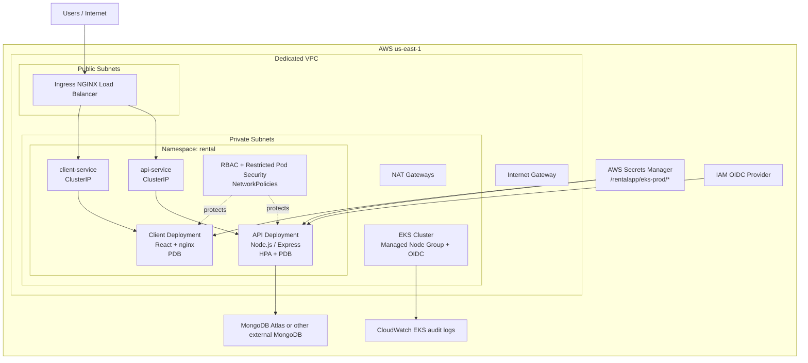

# RentalApp EKS Infrastructure

This repository contains the AWS infrastructure and Kubernetes manifests for running RentalApp on Amazon EKS. It is the EKS-focused cloud stack for the platform, with Terraform provisioning the AWS foundation and Kustomize defining the workloads that run on the cluster.

## Architecture



## What This Stack Includes

- A dedicated VPC with public and private subnets across multiple AZs.
- An EKS control plane with a managed node group.
- EKS add-ons for `vpc-cni`, `coredns`, and `kube-proxy`.
- An IAM OIDC provider for IRSA-ready add-ons and future AWS integrations.
- AWS Secrets Manager for application secrets, consumed via External Secrets Operator.
- Kubernetes resources (namespaces, deployments, services, HPAs, PDBs, ingress, network policies, External Secrets) provisioned by Terraform on top of the cluster.
- A GitHub Actions CI/CD pipeline that runs on GitHub-hosted `ubuntu-latest` runners, authenticates to AWS via OIDC, builds and pushes images to ECR, runs `terraform plan` and `terraform apply`, and verifies the rollout.
- Kustomize overlays kept as a manual fallback path; Terraform is the source of truth in production.

## Repository Layout

- [.github/workflows/deploy.yml](.github/workflows/deploy.yml) is the production CI/CD pipeline.
- [terraform/environments/eks-production](terraform/environments/eks-production) contains the EKS environment wrapper, GitHub OIDC trust, and Kubernetes resources managed via the Kubernetes/Helm providers.
- [terraform/modules/networking](terraform/modules/networking) creates the VPC, subnets, IGW, NAT gateways, and routing.
- [terraform/modules/eks-cluster](terraform/modules/eks-cluster) provisions the EKS cluster, node group, add-ons, OIDC provider, and the External Secrets IAM role.
- [terraform/modules/app-secrets](terraform/modules/app-secrets) stores app secrets in AWS Secrets Manager.
- [k8s/base](k8s/base) contains reusable Kubernetes resources used by Kustomize.
- [k8s/overlays/eks-production](k8s/overlays/eks-production) contains the EKS production overlay (manual fallback only; values are placeholders since Terraform owns these resources in production).
- [k8s/overlays/minikube](k8s/overlays/minikube) contains the local development overlay.
- [k8s/run-eks.sh](k8s/run-eks.sh) is a deprecated manual fallback for local debugging; the CI/CD pipeline is the production path.
- [k8s/run-minikube.sh](k8s/run-minikube.sh) bootstraps a local cluster for testing.

## AWS Infrastructure

Terraform is the source of truth for the cloud foundation. The EKS environment in [terraform/environments/eks-production/main.tf](terraform/environments/eks-production/main.tf) wires together:

1. The VPC and subnets from [terraform/modules/networking/main.tf](terraform/modules/networking/main.tf).
2. The EKS cluster and managed node group from [terraform/modules/eks-cluster/main.tf](terraform/modules/eks-cluster/main.tf).
3. Secrets stored in AWS Secrets Manager from [terraform/modules/app-secrets/main.tf](terraform/modules/app-secrets/main.tf).

Important defaults and guardrails:

- The cluster version defaults to Kubernetes 1.30.
- Worker nodes run in private subnets.
- The EKS API endpoint is intended to be CIDR-restricted.
- The EKS cluster runs in `API_AND_CONFIG_MAP` authentication mode and uses Access Entries for IAM-to-Kubernetes mapping.
- State is stored in S3 (`rentalapp-terraform-state-eks-prod`) with DynamoDB locking (`rentalapp-terraform-locks`).
- The GitHub Actions IAM role (`rentalapp-gha-deploy`) is granted only the scoped permissions it needs (ECR, EKS, EC2 networking, IAM with limits, Secrets Manager under `/rentalapp/*`, S3 state backend, DynamoDB locks, CloudWatch Logs, ELB) plus an explicit deny on dangerous IAM/billing/account actions.

## Kubernetes Runtime

In production the runtime layer is managed by Terraform's Kubernetes and Helm providers in [terraform/environments/eks-production/kubernetes.tf](terraform/environments/eks-production/kubernetes.tf). It provisions the namespace, RBAC, deployments, services, HPA, PDBs, ingress, network policies, and External Secrets, plus Helm releases for `ingress-nginx`, `cert-manager`, `metrics-server`, and `external-secrets`.

The Kustomize base under [k8s/base](k8s/base) is retained for parity with the manual fallback path and for local Minikube use:

- [k8s/base/namespace.yaml](k8s/base/namespace.yaml) enforces restricted Pod Security Admission.
- [k8s/base/rbac.yaml](k8s/base/rbac.yaml) creates tokenless service accounts and least-privilege RBAC.
- [k8s/base/api-deployment.yaml](k8s/base/api-deployment.yaml) defines the Node.js API with security hardening, probes, and resource limits.
- [k8s/base/client-deployment.yaml](k8s/base/client-deployment.yaml) defines the React/nginx frontend workload.
- [k8s/base/network-policies.yaml](k8s/base/network-policies.yaml) implements default-deny networking with explicit allows.
- [k8s/base/api-hpa.yaml](k8s/base/api-hpa.yaml) auto-scales the API.
- [k8s/base/api-pdb.yaml](k8s/base/api-pdb.yaml) and [k8s/base/client-pdb.yaml](k8s/base/client-pdb.yaml) protect availability during disruptions.

## Secrets Flow

Application secrets live in AWS Secrets Manager and are projected into the cluster via the External Secrets Operator.

1. Terraform writes the values to AWS Secrets Manager under the `/rentalapp/eks-prod` prefix (see [terraform/modules/app-secrets/main.tf](terraform/modules/app-secrets/main.tf)). The secret values are passed in by CI from GitHub Actions secrets (`MONGODB_URI`, `SESSION_SECRET`, `JWT_SECRET`).
2. The External Secrets controller runs in-cluster with an IRSA role (`rentalapp-eks-prod-external-secrets`) that can read those secrets.
3. A `SecretStore` and `ExternalSecret` (managed by Terraform) project the values into a Kubernetes `Secret` in the `rental` namespace.
4. The API and frontend consume the secret through environment variables (`envFrom`).

## Deployment

The production deployment path is the GitHub Actions pipeline. Local Terraform is used only for one-time bootstrap and break-glass operations.

### One-time bootstrap (run once from a workstation)

This seeds the OIDC trust, the GitHub Actions IAM role with its scoped policy, the EKS Access Entry, and the cluster itself.

```bash
cd terraform/environments/eks-production
terraform init
terraform plan -out=tfplan
terraform apply tfplan
```

After the bootstrap, configure the following GitHub Actions repository secrets:

- `AWS_ROLE_ARN` set to the `github_actions_role_arn` Terraform output (e.g. `arn:aws:iam::<account>:role/rentalapp-gha-deploy`).
- `MONGODB_URI`, `SESSION_SECRET`, `JWT_SECRET` for the application.

### Day-to-day deploys (CI/CD)

Push to `main` (or run the workflow manually with `auto_approve: true`) and [.github/workflows/deploy.yml](.github/workflows/deploy.yml) will:

1. Authenticate to AWS via OIDC by assuming `rentalapp-gha-deploy`.
2. Build and push the API and client images to ECR with `gha` build cache.
3. Resolve the immutable image digests for the freshly pushed tags.
4. Run `terraform init`, `terraform plan -out=tfplan`, and display the plan.
5. On `push` to `main` or when `auto_approve` is true, run `terraform apply tfplan`.
6. Configure `kubectl` against the cluster and run `kubectl rollout status` for both the API and client deployments.

### Configure kubectl manually

```bash
aws eks update-kubeconfig --region us-east-1 --name rentalapp-eks-prod-eks
```

## Security Model

- Namespace-level Pod Security Admission uses the `restricted` profile.
- Service account tokens are disabled for the app workloads.
- The API and client pods run as non-root users with read-only root filesystems.
- NetworkPolicy uses default-deny plus explicit ingress and egress paths.
- The EKS control plane logs are enabled for audit and troubleshooting.

## Operations And Verification

- Use [k8s/verification-runbook.md](k8s/verification-runbook.md) for smoke tests and policy checks.
- Use [terraform/environments/eks-production/README.md](terraform/environments/eks-production/README.md) for the environment provisioning flow.
- Use [k8s/README.md](k8s/README.md) for overlay behavior and local vs production deployment details.
- The CI/CD pipeline is the source of truth for production changes; the manual fallback in [k8s/run-eks.sh](k8s/run-eks.sh) is for local debugging only and may drift from Terraform-managed state.

## Local Testing

The Minikube overlay exists for safe local validation.

```bash
./k8s/run-minikube.sh
```

That path builds local images, enables the ingress and metrics addons, and applies the Minikube overlay with a single-node MongoDB for development.

## Notes

- This repository is EKS-first, but some older ECS-era files still exist in the tree during migration.
- Keep Terraform state, generated secret files, and local environment files out of Git.
- If you use a custom domain, point it at the ingress controller endpoint after AWS provisions the load balancer; do not hardcode the ELB hostname into Kustomize overlays.
- The self-hosted GitHub runner module under [terraform/modules/github-runner](terraform/modules/github-runner) is no longer used by the production pipeline. It can be removed in a future cleanup.
